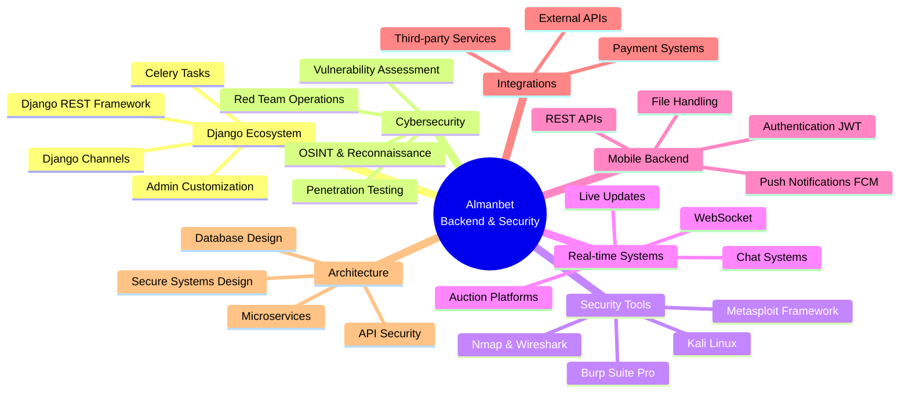

<div align="center">

# 👋 Привет! Я Алманбет Жумабай уулу

### 🚀 Python Backend Developer | 🛡️ Cybersecurity Specialist | 🔐 Penetration Tester


<p>
  
  
  
  
</p>

</div>

---

## 👨‍💻 О себе

> Опытный Python Backend Developer с **2+ годами** профессионального опыта в разработке масштабируемых веб и мобильных приложений. Специализируюсь на создании высоконагруженных систем с real-time функционалом, интеграцией платёжных систем и мобильных приложений.

```python
class AlmanbetZhumabaiUulu:
    def __init__(self):
        self.role = "Python Backend Developer"
        self.company = "KG FRIENDS"
        self.experience = "2+ years"
        self.location = "Kyrgyzstan"
        self.projects_delivered = 10
        
    def expertise(self):
        return {
            "backend": {
                "frameworks": ["Django", "Django REST Framework", "FastAPI"],
                "real_time": ["WebSocket", "Channels", "Daphne"],
                "async_tasks": ["Celery", "Redis", "RabbitMQ"],
                "databases": ["PostgreSQL", "Redis", "MongoDB"]
            },
            "mobile_backend": {
                "push_notifications": ["FCM (Firebase Cloud Messaging)"],
                "apis": ["RESTful API", "WebSocket API"],
                "authentication": ["JWT", "OAuth2", "Session"]
            },
            "payment_systems": ["FreedomPay", "AltynPay"],
            "devops": ["Docker", "Nginx", "Gunicorn", "Linux"],
            "architecture": ["Microservices", "Monolithic", "Event-Driven"]
        }
    
    def current_focus(self):
        return [
            "Building scalable backend systems",
            "Real-time applications with WebSocket",
            "Mobile app backend development",
            "System architecture & optimization"
        ]
```

---

## 💼 Опыт работы

<table>
<tr>
<td width="30%" align="center">

</td>
<td width="70%">

### 🏢 Python Backend Developer @ **KG FRIENDS**

- 🔧 Разработка и поддержка backend социальной платформы
- 🔌 Интеграция с внешними API и сервисами
- ⚡ Оптимизация производительности и масштабируемости
- 🚀 Внедрение новых функций и улучшение архитектуры

</td>
</tr>
<tr>
<td width="30%" align="center">

</td>
<td width="70%">

### 💻 Python Backend Developer - **Freelance**

- 📱 **10+ проектов**: веб-приложения, мобильные backend системы
- 💳 Интеграция платёжных систем (FreedomPay, AltynPay)
- 📲 Реализация push-уведомлений через FCM
- 🔄 Real-time функционал с WebSocket
- 🏗️ Полный цикл разработки от концепции до деплоя

</td>
</tr>
</table>

---

## 🎓 Образование

<details open>
<summary><b>📚 Нажмите для просмотра</b></summary>

<br>

**🎓 Mechatronics and Robotics** - *Kyrgyz State Technical University named after I. Razzakov* (2018)
- Программирование встроенных систем
- Автоматизация и управление техническими системами

**💻 Full Stack Python Praktikum** - *MohirDev* (Декабрь 2021 - Май 2022)
- Django & Django REST Framework
- WebSocket & Real-time applications
- Frontend (HTML, CSS, JavaScript)
- Deployment & DevOps

</details>

---

## 🛠️ Технологический стек

<div align="center">

### Backend Core


### Real-time & Async


### Databases


### Mobile & Notifications


### Payment Integration


### Frontend Skills


### DevOps & Deployment


### Tools & Other


### 🛡️ Cybersecurity & Pentesting


</div>

---

## 🚀 Избранные проекты (10+)

<details open>
<summary><b>🏢 Enterprise & CRM Systems</b></summary>

<br>

### 🧼 UNAA - Автомойка и детейлинг система
**Stack:** Django REST | WebSocket | PostgreSQL | Celery | FCM | Nginx

```
📦 Архитектура:
├── 🎛️ UNAA Admin CRM — Админ панель управления
├── 📱 UNAA Employee Mobile — Приложение для сотрудников
└── 🌐 UNAA Client — Веб-приложение для клиентов
```

**Ключевые фичи:**
- ⚡ Real-time обновления через WebSocket
- 📲 Push-уведомления для сотрудников и клиентов
- 📊 Система управления заказами и статистикой
- 👥 Многоуровневая система ролей

---

### 🎠 SKYPARK - Семейно-развлекательный комплекс
**Stack:** Django REST | WebSocket | PostgreSQL | Celery | FCM

```
📦 Компоненты:
├── 👶 NANNY SKYPARK — Приложение для сотрудников
├── 👨‍👩‍👧 SKYPARK — Приложение для родителей
└── 🎛️ CRM SKYPARK — Панель управления
```

**Фичи:**
- 💰 Система оплаты и кэшбэка
- 📍 Трекинг местоположения детей
- 🔔 Система уведомлений
- 📅 Бронирование услуг

---

### 🍼 BALAKAI - Детский сад
**Stack:** Django REST | WebSocket | PostgreSQL | Celery | FCM

**Возможности:**
- 📸 Фото/видео отчёты о ребёнке
- 📊 Отслеживание активности
- 💬 Чат с воспитателями
- 🍽️ Меню и питание

</details> <details> <summary><b>🎓 Образовательные платформы</b></summary> <br>

💡 Лучшее IT-решение для детских учреждений: детские сады, школы, спортивные и творческие секции.

🎯 Миссия проекта: сделать взаимодействие между детскими учреждениями и родителями простым, современным и удобным — в одном цифровом пространстве.

</details>

<br>

### 📚 MSycamore - Образовательная платформа
**Stack:** Django | PostgreSQL | WebSocket | Full Stack

🔗 **Live:** [msycamore.edu.kg](https://msycamore.edu.kg)

**Реализовано:**
- 📖 Система курсов и модулей
- ✅ Тестирование и оценка знаний
- 👨‍🎓 Личные кабинеты студентов
- 💬 Система комментариев и обратной связи

</details>

<details>
<summary><b>📱 Мобильные приложения</b></summary>

<br>

### 📢 Региональные платформы объявлений (5 проектов)

**Проекты:**
- 🏔️ **Batken ONLINE** - Мобильное приложение
- 🌄 **Talas ONLINE** - Мобильное приложение  
- 🏞️ **Isykul ONLINE** - Мобильное приложение
- 🏙️ **Narun ONLINE** - Мобильное приложение
- 🏛️ **MOSCOW ONLINE** - Мобильное приложение

**Stack:** Django REST | PostgreSQL | FCM

✅ **Все приложения опубликованы в маркетах**

**Функционал:**
- 📝 Размещение объявлений
- 🔍 Поиск и фильтрация
- 💼 Продвижение бизнеса
- 📲 Push-уведомления
- ⭐ Система рейтингов

</details>

<details>
<summary><b>💼 Коммерческие проекты</b></summary>

<br>

### 🚗 AUCTION - Автоаукцион
**Stack:** Django REST | WebSocket | FreedomPay | PostgreSQL

**Инновационные фичи:**
- 📹 Reels-стиль просмотра авто
- 🔔 Подписки на аукционы
- ⚡ Real-time торги через WebSocket
- 📅 Календарь аукционов
- 💳 Интеграция платёжной системы FreedomPay
- 🚗 Модерация объявлений

---

### ✈️ Aeronomad - Авиакомпания
**Stack:** Django | PostgreSQL | REST API | Django Unfold

🔗 **Website:** Корпоративный сайт авиакомпании

**Возможности:**
- ✈️ Информация о рейсах и расписании
- 💰 Онлайн бронирование билетов
- 🎫 Персонализированные предложения
- 📊 Админ-панель управления

</details>

---

## 📊 GitHub Статистика

<div align="center">
  
  
</div>

<div align="center">
  
  
</div>

---

## 🏆 Достижения

<div align="center">

### 💪 Ключевые метрики

<table>
<tr>
<td align="center">

<br><b>Опыт разработки</b>
</td>
<td align="center">

<br><b>Проектов реализовано</b>
</td>
<td align="center">

<br><b>Приложений в маркетах</b>
</td>
</tr>
<tr>
<td align="center">

<br><b>Real-time системы</b>
</td>
<td align="center">

<br><b>Платёжные системы</b>
</td>
<td align="center">

<br><b>Мобильные backend</b>
</td>
</tr>
</table>

### 🏅 GitHub Трофеи


</div>

---

## 💡 Специализация

<div align="center">



</div>

---

## 📈 Технические навыки

<table>
<tr>
<td width="50%" valign="top">

### 🎯 Backend Development
- ✅ Django & Django REST Framework
- ✅ WebSocket & Real-time applications
- ✅ PostgreSQL database design
- ✅ Celery & async task processing
- ✅ Redis caching & message broker
- ✅ RESTful API architecture
- ✅ JWT & OAuth2 authentication
- ✅ Docker containerization

</td>
<td width="50%" valign="top">

### 🛡️ Cybersecurity & Pentesting
- ✅ **Penetration Testing** (Web, Network, API)
- ✅ **Red Team Operations** & Attack Simulation
- ✅ **OSINT** & Information Gathering
- ✅ **Kali Linux** & Security Tools
- ✅ **Metasploit Framework**
- ✅ **Burp Suite** Professional
- ✅ **Nmap, Wireshark** Network Analysis
- ✅ **OWASP Top 10** Vulnerability Testing

</td>
</tr>
<tr>
<td width="50%" valign="top">

### 🚀 Additional Skills
- ✅ Mobile app backend development
- ✅ Push notifications (FCM)
- ✅ Payment gateway integration
- ✅ Nginx & Gunicorn configuration
- ✅ Linux server administration
- ✅ Git version control

</td>
<td width="50%" valign="top">

### 🔒 Security Practices
- ✅ Secure API development
- ✅ Vulnerability assessment & reporting
- ✅ Security auditing
- ✅ Ethical hacking
- ✅ Network security analysis
- ✅ Security documentation (Swagger)

</td>
</tr>
</table>

---

## 📫 Связаться со мной

<div align="center">

<table>
<tr>
<td align="center" width="33%">

[](https://t.me/HIalmanbet1)

**Telegram**
<br>
Быстрая связь

</td>
<td align="center" width="33%">

[](https://instagram.com/almanbet_z_2)

**Instagram**
<br>
Социальные сети

</td>
<td align="center" width="33%">

[](https://linkedin.com/in/almanbet-zhumabayev)

**LinkedIn**
<br>
Профессиональная сеть

</td>
</tr>
<tr>
<td align="center" colspan="3">

[](mailto:hialmanbet@gmail.com)

**Email:** almanbet.dev@gmail.com

</td>
</tr>
</table>

### 💼 Открыт для:
🤝 Коммерческих проектов | 💻 Фриланс заказов | 🚀 Интересных стартапов | 👥 Сотрудничества

</div>

---

<div align="center">

### 💭 Цитата для вдохновения


### 🐍 Моя активность

<picture>
  <source media="(prefers-color-scheme: dark)" srcset="https://raw.githubusercontent.com/zhumabayuulu/zhumabayuulu/output/github-contribution-grid-snake-dark.svg">
  <source media="(prefers-color-scheme: light)" srcset="https://raw.githubusercontent.com/zhumabayuulu/zhumabayuulu/output/github-contribution-grid-snake.svg">
  
</picture>

---

### ⚡ Fun Fact

*"От образовательных платформ до автоаукционов — создаю backend системы, которые масштабируются вместе с бизнесом!"*

<br>

**📊 2+ года опыта • 🚀 10+ проектов • 📱 6+ приложений в маркетах**


</div>
